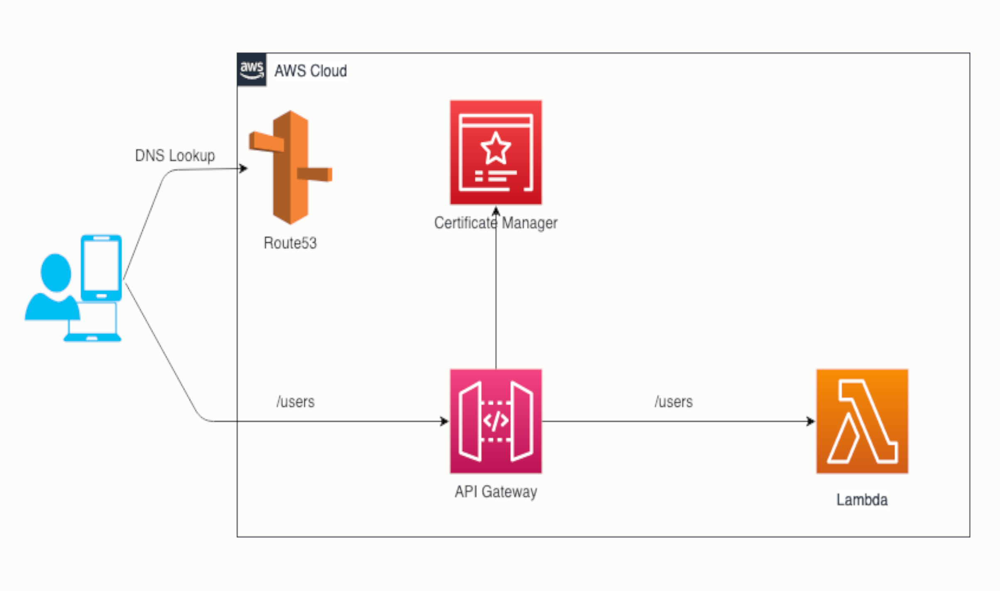

# Exemplo de provisionamento do AWS API Gateway

Este repositório de exemplo demonstra a implantação de infraestrutura e serviços usando o terragrunt. O exemplo mostra como implantar alguns serviços, como AWS API Gateway, uma lambda, etc. Ele utiliza o AWS S3 para armazenar o estado do terraform remoto.

## Infraestrutura Alvo

A figura a seguir mostra uma visão geral simplificada da arquitetura da infraestrutura alvo. Ela oculta muitos detalhes, como IAM, Cloudwatch, Zona Hospedada, etc.



## Estrutura do Projeto

- `lambda`: A amostra de lambda em javascript

- `terragrunt/modules`: Este diretório contém todos os módulos personalizados do terragrunt. Cada módulo contém vários arquivos terraform que são separados logicamente com base no recurso que cria/modifica. Eles também incluem o arquivo `inputs.tf`, que define todas as entradas necessárias para o módulo, e o arquivo `outputs.tf`, que define as saídas exportadas pelo módulo.

- `terragrunt/aws-account-x`: Este diretório contém os arquivos de implantação do terragrunt. Neste aplicativo, a implantação é separada por aplicativo. Isto é, `api-gateway-example-app`, o aplicativo de exemplo. Dentro de cada aplicativo, há novamente uma separação lógica para cada dependência, por exemplo: `api-gateway-example-app/lambda`, `api-gateway-example-app/route53`, `api-gateway-example-app/api-gateway`, etc.

- Às vezes, você também precisa configurar recursos de nível de conta que são compartilhados entre vários aplicativos. Estes vão para `terragrunt/aws-account-x/account-level-resources`.

## Implantação

- Defina os detalhes relacionados à sua conta aws no arquivo `terragrunt/aws-account-x/account.yaml`, como número da conta, zonas etc.
- Você também pode querer atualizar detalhes como nome de domínio, etc, na maioria dos arquivos `terragrunt.hcl`, `env.yaml` & `global.yaml`
- Instale as ferramentas de linha de comando `aws`, `node`, `yarn`, `terraform` e `terragrunt`
- Configure o cli do `aws`. Veja a [documentação da AWS](https://docs.aws.amazon.com/cli/latest/userguide/cli-chap-configure.html) para mais detalhes
- Faça login na sua conta aws usando o cli
- Verifique se você fez login com sucesso executando alguns comandos, como `aws ec2 describe-instances`
- O comando `terragrunt plan` mostrará o plano de implantação, como quais recursos precisam ser adicionados, modificados ou removidos
- O comando `terragrunt apply` aplicará as mudanças aos seus recursos da AWS
- Para a primeira implantação, siga a ordem `lambda`, `acm`, `api-gateway` e `route53`

### Exemplo de Lambda

#### Construindo Lambda

Você pode usar sua ferramenta favorita (`npm` ou `yarn`) para construir a lambda

```sh
cd lambda
yarn install
yarn zip
```

#### Implementando Lambda

```sh
cd terragrunt/aws-account-x/api-gateway-example-app/lambda 
terragrunt plan
terragrunt apply
```

### Exemplo de API Gateway

#### ACM (AWS Certificate Manager)

Você precisa primeiro implantar seu certificado SSL no ACM ou criar um novo usando o ACM. Você só precisa fazer isso quando tiver um novo certificado (por exemplo: um certificado renovado). No caso do nosso aplicativo de exemplo, estamos criando um novo certificado baseado em `DNS` usando o ACM.

```sh
cd terragrunt/aws-account-x/api-gateway-example-app/acm 
terragrunt plan
terragrunt apply
```

#### API Gateway -- Parei aqui !!

```sh
cd terragrunt/aws-account-x/api-gateway-example-app/api-gateway 
terragrunt plan
terragrunt apply
```

#### Route53

No caso do nosso aplicativo de exemplo, estamos usando o AWS Route53 como nosso servidor DNS. Você pode precisar implantar isso apenas uma vez, a menos que precise alterar suas informações de roteamento.

```sh
cd terragrunt/aws-account-x/api-gateway-example-app/route53 
terragrunt plan
terragrunt apply
```

## Testando

Faça um

 pedido `POST` para o endpoint `users.{SEU_DOMINIO_AQUI}/users` com qualquer carga e verifique a resposta